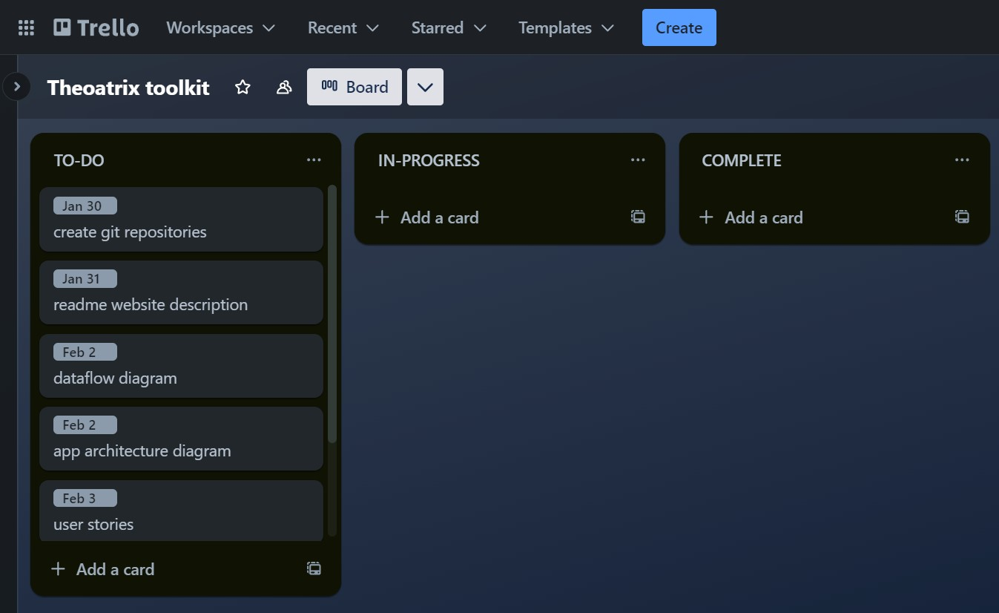

# Theoatrix Toolkit

Frontend Repository: https://github.com/theomarentes/theoatrix-toolkit-frontend

Backend Repository: https://github.com/theomarentes/theoatrix-toolkit-backend 

## Website Description
The Theoatrix Toolkit will help users solve complex calculations with the goal of improving their experience playing RuneScape.

### Purpose
In RuneScape, players control a single character, enduring long grinds to increase their skill levels and aquire top tier equipment. The Theoatrix Toolkit will make difficult skill level calculations easier, it will track the user’s progress in the game and track the prices of equipment, using 3 different APIs.

WiseOldMan API: https://docs.wiseoldman.net/

Wiki GE API: https://prices.runescape.wiki/api/v1/osrs

Official API: https://secure.runescape.com/m=hiscore_oldschool/

Our database will store information from these APIs with periodic and user triggered scrapes.

### App Structure

Account Tracker Page
- WiseOldMan API

Skill Guides Page
- Written Guides (already written)
- Videos Guides (already created)
  
Calculators Page
- gp/xp calculator (Wiki GE API)
- Time to Max (WiseOldMan API)
- Alch calculator (dynamic pages for each item) (Wiki GE API) 

Grand Exchange Page
- Wiki GE API
- Hourly scrapes to database
  
My Account Page
- User login
- Favourite calculators
- Favourite items
- Favourite guides

### Target Audience
The Theoatrix Toolkit targets RuneScape players & Theoatrix's fans. Since the toolkit is diverse, the tools are helpful for **all** RuneScape players. Over 300 million RuneScape accounts have been created.

### Tech Stack
MERN Stack

### Libraries Used
In the development and production of the Theoatrix Toolkit, x libraries were used.
| Library |     Description     |
|---------|---------------------|
| nodemon | nodemon description |

## Dataflow Diagram	
HD: Provides dataflow diagram(s) that strictly follow the standard convensions to clearly identify the processes within your application. Clearly depicts where data is coming from, where it is going and how it is being stored.

## Application Architecture Diagram
HD: Shows almost flawless understanding of the high level structure of the app

## User Stories
Provide UX/UI design documentation(user stories) that adequately show Agile methodology implementation.
HD: Provides multiple user stories that use ‘persona, what and why’ that outline meaningful features of project. Shows evidence of user story revision and refinement.

## Wireframes
for multiple standard screen sizes, created using industry standard software
Utilise an industry standard program for creation of wireframes
Provide UX/UI design documentation(wireframes) that adequately show Agile methodology implementation.
HD: Provides wireframes that show exceptional planning of project flow and structure including but not limited to space distribution, content prioritisation, intended actions, functions, relationships between screens.

## Trello Board
Select and follow a commonly used planning methodology, such as Kanban, Trello, Jira, or Asana.
HD: Simple and clear standards for planning methodology chosen and adhered to

### 30th January (Initial Board)

Our initial board consisted of 

## Testing
Development Testing
Production Testing
