# Theoatrix Toolkit

Live Site URL: https://toolkit.theoatrix.net/

Frontend Repository: https://github.com/theomarentes/theoatrix-toolkit-frontend

Backend Repository: https://github.com/theomarentes/theoatrix-toolkit-backend 

---

### Table Of Contents
[Website Description](https://github.com/theomarentes/toolkit.theoatrix.net#website-description)

[Application Architecture Diagram](https://github.com/theomarentes/toolkit.theoatrix.net#application-architecture-diagram)

[Dataflow Diagram](https://github.com/theomarentes/toolkit.theoatrix.net#dataflow-diagram)

[User Stories](https://github.com/theomarentes/toolkit.theoatrix.net#user-stories)

[Wireframes](https://github.com/theomarentes/toolkit.theoatrix.net#wireframes)

[Libraries Used](https://github.com/theomarentes/toolkit.theoatrix.net#libraries-used)

[Testing](https://github.com/theomarentes/toolkit.theoatrix.net#testing)

[Trello Board](https://github.com/theomarentes/toolkit.theoatrix.net#trello-board)

---

## Website Description
The Theoatrix Toolkit will allow users to solve complex calculations with the goal of improving their experience playing RuneScape.

### Purpose
In RuneScape, players control a single character, enduring long grinds to increase their skill levels and aquire top tier equipment. The Theoatrix Toolkit will make difficult skill level calculations easier, it will track the user’s progress in the game and track the prices of equipment, using 3 different APIs.

WiseOldMan API: https://docs.wiseoldman.net/

Wiki GE API: https://prices.runescape.wiki/api/v1/osrs

Official API: https://secure.runescape.com/m=hiscore_oldschool/

Our database will store information from these APIs with periodic and user triggered scrapes.

### App Structure
Account Tracker Page
- WiseOldMan API

Level 1-99 Guides Page
- Links to video guides
  
Calculators Page
- Time to Max (WiseOldMan API)
- Alch calculator (dynamic pages for each item) (Wiki GE API)

Simulators Page
- Drop Simulator (OSRSBox JSON)

Grand Exchange Page
- Wiki GE API
- Hourly scrapes to database
- One page per item (dynamic)
  
My Account Page
- User login
- Favourite calculators
- Favourite items
- Favourite guides

### Target Audience
The Theoatrix Toolkit targets RuneScape players & Theoatrix's fans. The toolkit is for RuneScape enthusiasts seeking an all-in-one solution to enhance their gameplay and stay informed about the dynamic world of RuneScape.

Above: RuneScape's Concurrent Player Count (2013-2024)

From seasoned players looking for advanced strategies to newcomers eager to navigate the intricacies of the game, Theoatrix's toolkit aspires to be a gaming companion, empowering players at every level.

### Tech Stack
The upcoming Theoatrix RuneScape Toolkit will be developed using the MERN (MongoDB, Express.js, React, Node.js) stack.
MongoDB, a NoSQL database, will efficiently store diverse user and equipment data.
Express.js will facilitate backend development, integrating with Node.js for server-side execution.
The frontend will leverage React, ensuring a responsive user interface.
The MERN stack will enable real-time updates on in-game progress and item prices. As users explore Theoatrix's guide videos and written content, the MERN stack will give a dynamic experience. 

## Application Architecture Diagram

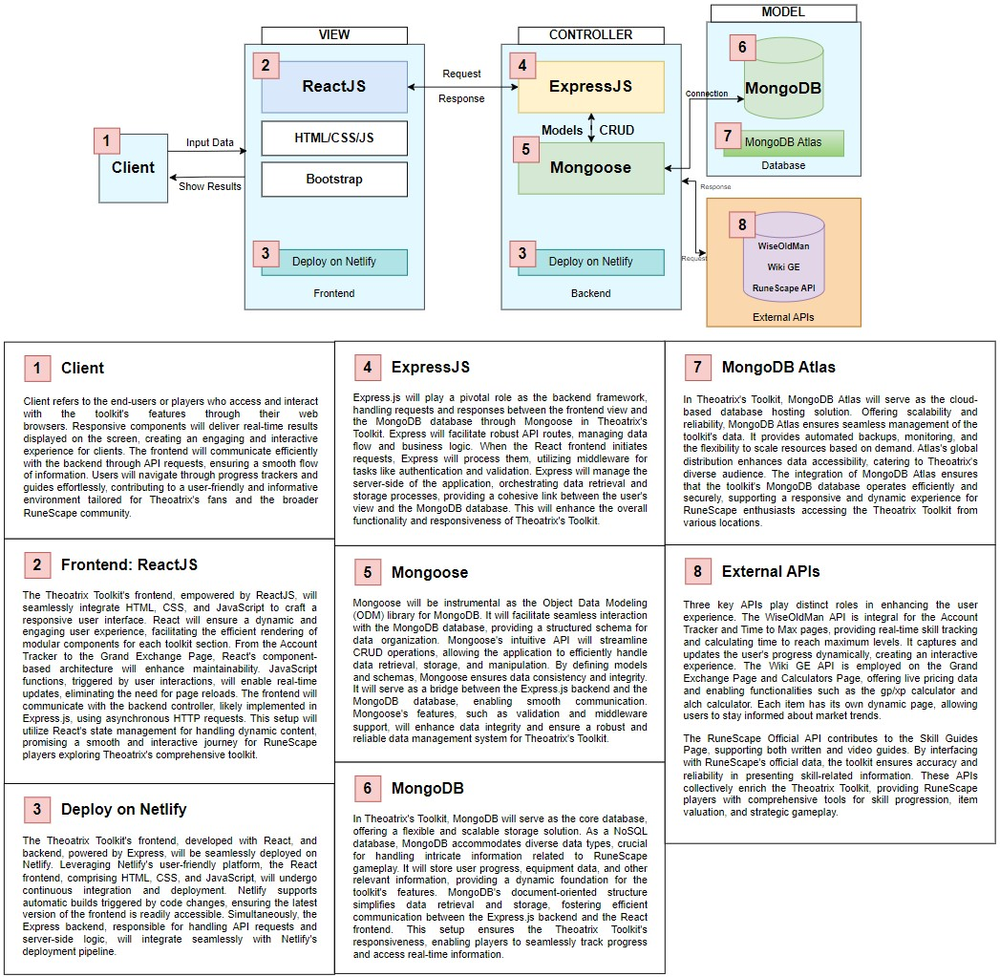

The theoatrix toolkit's architecture is designed to provide Runescape players with a seamless and engaging experience, at the forfront are the clients, accessing the toolkit through web browsers, navigathing through progress trackers and guide. The frontend being powered by ReactJS ensures a dynamic and responsive user interface with modular components for various toolkit selections.

The deployment process is streamlined through netlify, offering a continuous inegration and deployment for the React frontend and Express backend. Express.js plays a pivotal role, managing API routes and serving as the bridge between the React frontend and MongoDB database. MongoDB serves as the core database, storing user progress, equipment data and providing a flexible but most importantly scalable solution.

MongoDB Atlas serves as the cloud-based hosting solution, offering scalability, reliability and global distribution for efficient data management. External APIs play a distinct role in enhancing the user experience. These APIs provide real-time skill tracking, live pricing data and skill guides, enriching the toolkit's features.

## Dataflow Diagram	
Thirteen dataflow diagrams were created to support the development of the Theoatrix Toolkit. Click the image to enlarge the Dataflow Diagram.

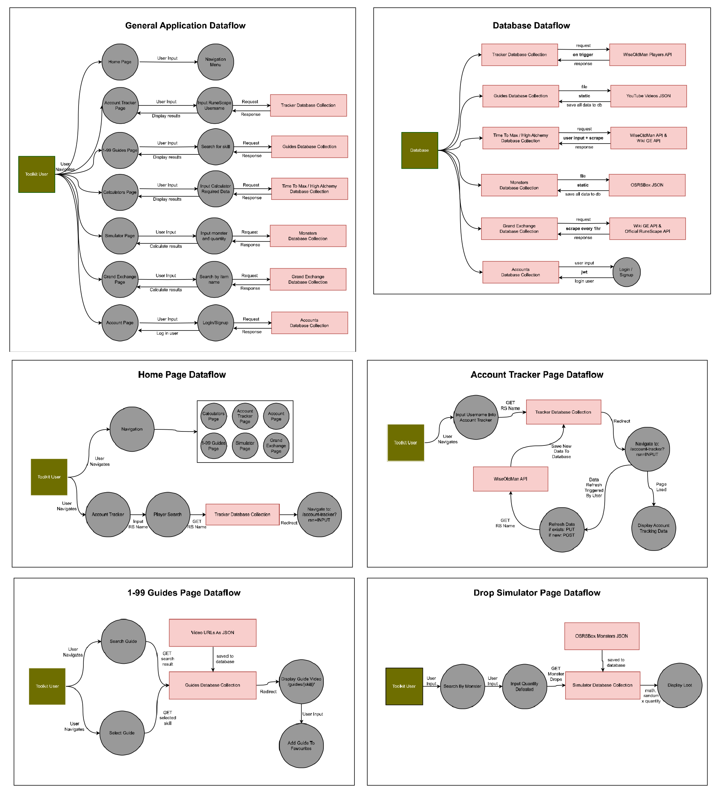

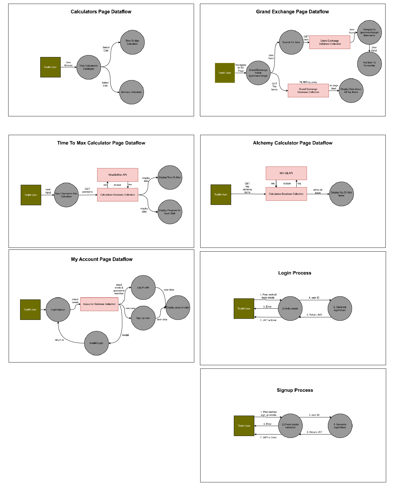

## User Stories
**Story:** As a low level RuneScape player, I want to see how long it will take me to get to level 99 in magic, so that I can estimate how many months before I can defeat this boss.

**Tookit Feature:** Account Tracker Page

**Description:** The toolkit will allow a player to input their RuneScape name and it will show how long it takes to reach level 99 in any skill.

**Edits:** The toolkit will show the percentage to level 99 however requires too much extra input to work out the time.

---

**Story:** As a player with level 94 crafting, I want to read a crafting levelling guide, so that I can get to level 99 crafting as fast as possible.

**Tookit Feature:** Skill Guides Page

**Feature:** The toolkit will include written guides for every skill in RuneScape, showing how to level up from 1 to 99 (already written).

**Edits:** We decided against adding the skill guides page simply because those guides are already displayed on the base website (theoatrix.net).

---

**Story:** As a player with level 68 smithing, I want to know what levelling method I should be using, so that I can earn coins while I level up.

**Tookit Feature:** Skill Guides Page

**Feature:** The toolkit will include video guides for every skill in RuneScape, showing how to level up from 1 to 99 (already written).

**Edits:** We decided against adding the skill guides page simply because those guides are already displayed on the base website (theoatrix.net).

---

**Story:** As a player with 100 million gold coins, I want to know how much construction experience I can gain by spending it all, so that I can upgrade my player-owned-house.

**Tookit Feature:** Calculators Page -> GP/XP Calculator

**Feature:** The toolkit's gp/xp calculators will allow users to view the cost of levelling. Gp/xp stands for gold pieces per experience point.

**Edits:** Removed GP/XP Calculator due to large amount of data required to function.

---

**Story:** As a player with 4300 hours played, I want to know how many hours are left until I reach level 99 in every skill, so that I can plan ahead with what skills to train.

**Tookit Feature:** Calculators Page -> Time To Max

**Feature:** The toolkit's time to max calculator will allow players to input their RuneScape name and see exactly how many hours remain before they reach level 99 in every skill if they play efficiently. This will be done using the WiseOldMan API.

**Edits:** Can also show the time to 200 million experience using the WiseOldMan API.

---

**Story:** As a player with high combat levels, I want to see what drops I'll get from a boss, so that I can see how much money I'm going to make.

**Tookit Feature:** Simulators Page

**Feature:** The toolkit's simulators will display drops from all bosses and monsters so that the user can simulate the potential loot.

**Edits:**  User Story added 2/2/24 - Added simulators functionality to plan.

---

**Story:** As a player with 4 million bird's nests, I want to track the price of bird's nests, so that I can sell them when they increase by 10%.

**Tookit Feature:** Grand Exchange Page

**Feature:** The toolkit's grand exchange feature will allow users to search for any RuneScape item to see the price graph and trade volume. This will be done with the Wiki GE API.

**Edits:**  Adding alerts for a 10% price increase can be a future feature.

---

**Story:** As a Theoatrix Fan, I want to save my favourite guides and calculators, so that I can use them in the future.

**Tookit Feature:** My Account Page

**Feature:** The toolkit will allow users to login and save calculators and guides to their account.

**Edits:** This feature could use local storage.

## Wireframes
Balsamiq was used to create the wireframes for the Theoatrix Toolkit. The software provides a professional and user-friendly interface with a high number of overlays.

### Page Layout Wireframes

### Home Page Wireframes
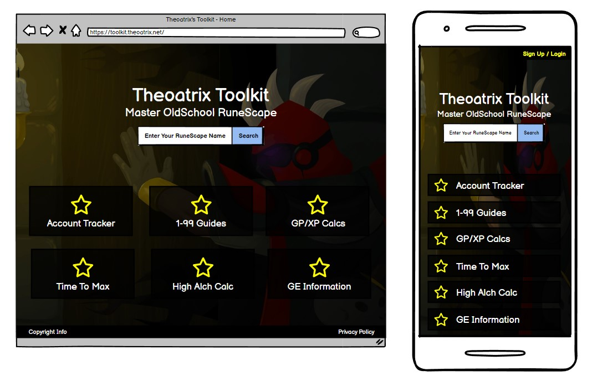

### Account Tracker Page Wireframes

### 1-99 Guides Page Wireframes
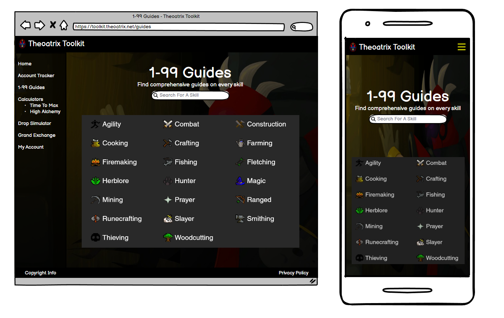
### Calculators Page Wireframes
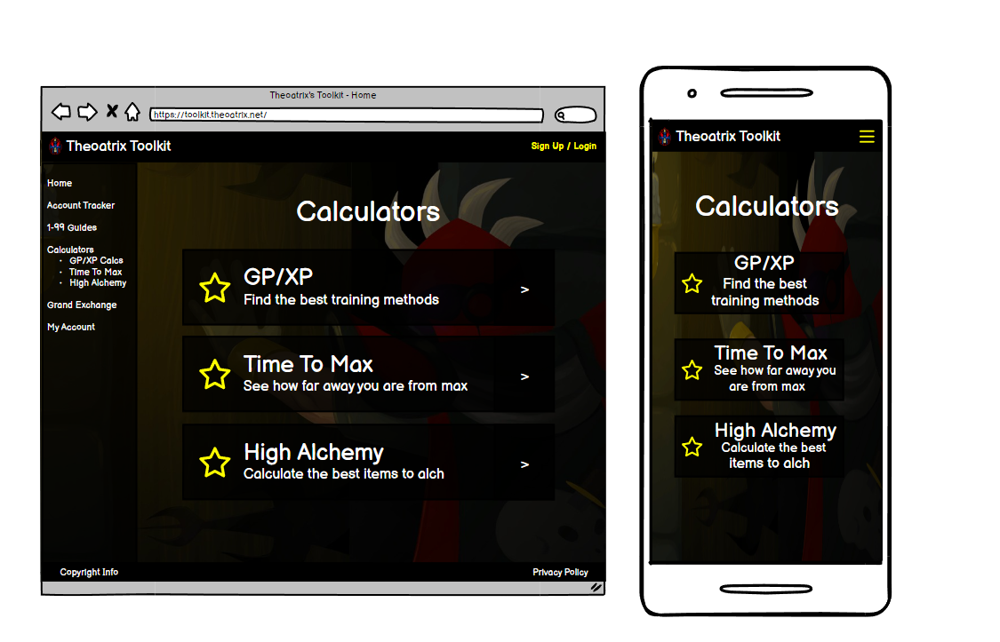
### Time To Max Calculator Wireframes

### Alchemy Calculator Wireframes

### Drop Simulator Wireframes

### Grand Exchange Page Wireframes

### Grand Exchange Item Page Wireframes

### Account Page Wireframes

## Libraries Used
### Backend Dependencies
- **express**: Serves as the web application framework for building the toolkit's server-side logic, including API endpoints and middleware.
- **helmet**: Increases security by adding various HTTP headers to protect against common web vulnerabilities and attacks.
- **jsonwebtoken**: Implements JSON Web Tokens for secure user authentication and session management across the toolkit's services.
- **mongoose**: Provides a MongoDB object modeling tool to simplify interactions with the database and enforce schema structures.
- **@wise-old-man/utils**: Utilized for integrating Old School RuneScape data processing and analysis utilities into the toolkit.
- **axios**: Employed to make HTTP requests to external APIs, including Old School RuneScape's official data sources and other third-party services.
- **bcrypt**: Used to securely hash and compare user passwords, enhancing the security of user account management within the toolkit.
- **cors**: Enables the toolkit's backend services to accept cross-origin requests, facilitating communication between the client-side application and the server.
- **dotenv**: Manages environment variables, allowing secure and flexible configuration of the toolkit's backend environment.

#### Backend DevDependencies
- **jest**: A testing framework used for writing and running unit tests to ensure the reliability and correctness of the toolkit's backend logic.
- **nodemon**: Automates the process of restarting the node application when file changes in the directory are detected, improving development efficiency.
- **supertest**: Facilitates testing of HTTP endpoints, allowing for automated testing of Express routes to ensure API reliability and correctness.

### Frontend Dependencies
- **react**: A JavaScript library for building user interfaces, serving as the backbone for developing the Theoatrix Toolkit's dynamic and interactive web pages.
- **react-bootstrap**: Combines Bootstrap styling with React components, facilitating the development of the Theoatrix Toolkit's UI with predefined, stylized components.
- **react-dom**: Offers DOM-specific methods necessary for the Theoatrix Toolkit to render UI components efficiently in the web browser.
- **react-router-dom**: Manages navigation and routing in the Theoatrix Toolkit, enabling seamless transitions between different views without reloading the page.
- **react-scripts**: Provides a set of scripts from Create React App to automate the build process, testing, and setting up the development environment for the Theoatrix Toolkit.
- **web-vitals**: Assists in measuring the performance of the Theoatrix Toolkit's web pages, focusing on user experience metrics like loading time, interactivity, and visual stability.

#### Frontend DevDependencies
- **jest**: A JavaScript testing framework used to create and run tests for the Theoatrix Toolkit's codebase, ensuring reliability and functionality.
- **jest-fetch-mock**: Mocks the global fetch API in Jest tests, allowing for testing of asynchronous HTTP requests in the Theoatrix Toolkit without making actual network calls.
- **@testing-library/jest-dom**: Provides custom matchers for Jest, making it easier to assert various conditions in the Theoatrix Toolkit's DOM elements during testing.
- **supertest**: A library for testing HTTP assertions, making it easy to test API endpoints of the Theoatrix Toolkit's backend services directly.
- **@babel/preset-env**: Automatically compiles JavaScript ES6+ code down to ES5 for broader browser compatibility in the Theoatrix Toolkit.
- **@babel/preset-react**: Transforms JSX syntax into JavaScript, allowing the Theoatrix Toolkit's React components to be understood by browsers.
- **@testing-library/react**: Facilitates unit and integration testing of React components in the Theoatrix Toolkit, simulating user interactions within a virtual DOM environment.
- **@testing-library/user-event**: Simulates real user actions (e.g., clicking, typing) in web elements, enhancing testing accuracy for the Theoatrix Toolkit.

## Testing
Tests were completed with Jest, Babel and Supertest.
### Frontend Testing

### Backend Testing

### Development Testing
During development, the website was made available to a small group of Theoatrix's fans who were connected with the Theoatrix clan. 

- RuneScape Name: Fe Beug
- Website Feature: Account Tracker
- Testing Comments: "its cool to see all of my bossing killcounts. the menu on the left derails flow when scrolling, loading time took slightly long"

---

- RuneScape Name: Brewmate7
- Website Feature: Account Tracker
- Testing Comments: "I was able to enter my runescape name and find my stats"

---

- RuneScape Name: sober maybe
- Website Feature: Drop Simulator
- Testing Comments: "i like the idea - some of the item icons arent showing for me"
  
---

- RuneScape Name: Zeixic
- Website Feature: Grand Exchange
- Testing Comments: "I never knew there was 4 items above max cash. I think this has a lot of potential."

---

- RuneScape Name: d13faster
- Website Feature: Time To Max
- Testing Comments: "this information is so useful. maybe you could add a breakdown of the time to max"
  
---

- RuneScape Name: Datuk
- Website Feature: Time To Max
- Testing Comments: "best tool ive seen for seeing your distance to max cape"

### Production Testing
For production testing, the toolkit was promoted in the Theoatrix clan chat to more users.

- RuneScape Name: Kandarin
- Testing Video: https://www.youtube.com/watch?v=d8CBpVcbqyc 
- Testing Comments: "Whenever first logging onto the Theoatrix Toolkit website I was met with a screen where I could input my runescape username. After inputting my runescape username, a bunch of stats as well as trackers were pulled up about my account providing useful information that would not be easily accessible all in one place otherwise. Not only that but signing up for an account was very simple and after signing up for an account, I was able to favorite my account search, making it easily accessible in the future."

---

- RuneScape Name: 
- Testing Video: 
- Testing Comments:
  
---

- RuneScape Name: 
- Testing Video: 
- Testing Comments:

## Trello Board
Our chosen planning methodology involved using Trello to track tasks.

### 30th January (Initial Board)
Our initial board consisted of the tasks required to complete Part A.

### 31st January 
Progress continued with Trello keeping us on track and ensuring smooth progress through the required tasks.

### 2nd February
The website description and app architecture diagram was completed.
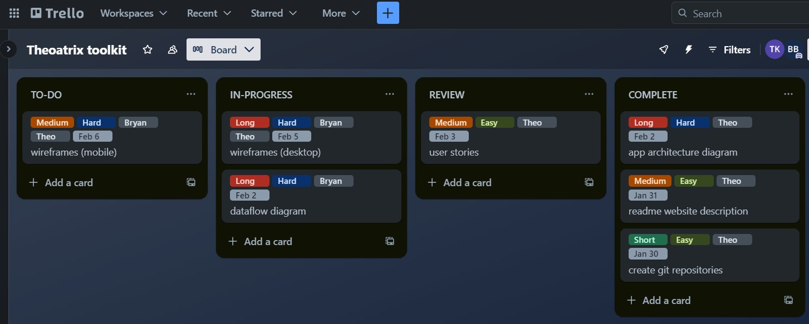

### 4th February
The dataflow diagrams, user stories and wireframes were completed.
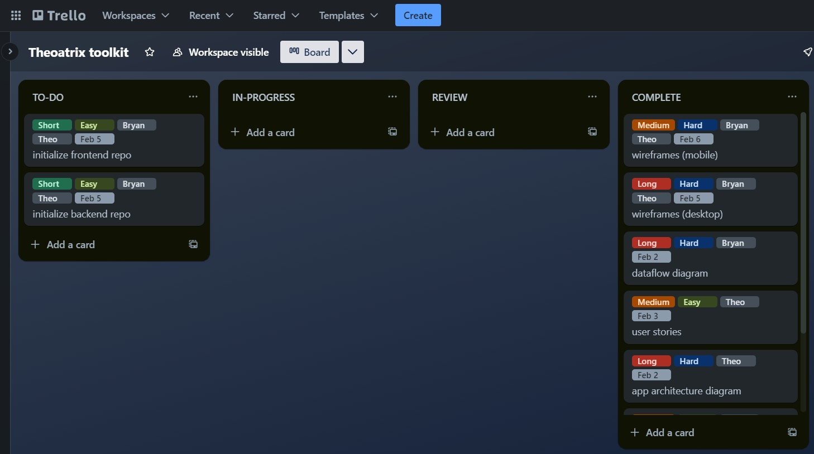

### 6th February
Homepage development began while the Mongo Atlas database was set up.
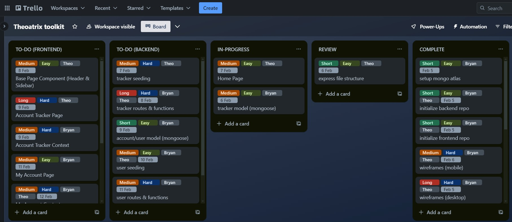

### 8th February
The home page and time to max page was completed and ready for review.
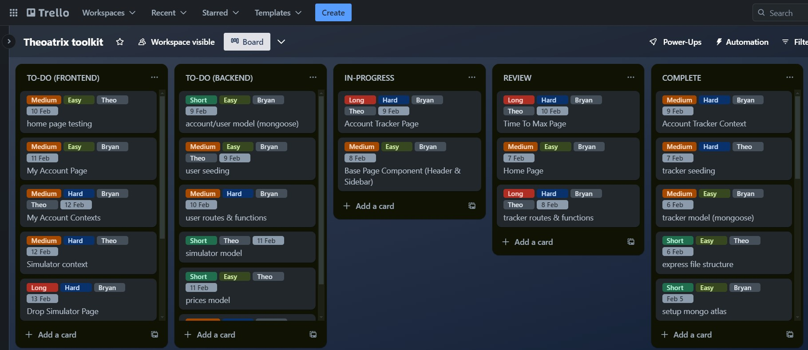

### 11th February
The my account page and user functionality was added.
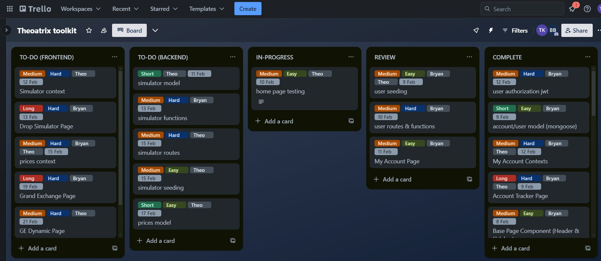

### 15th February
Drop simulator page completed and the Grand Exchange page plus dynamic page are in progress.
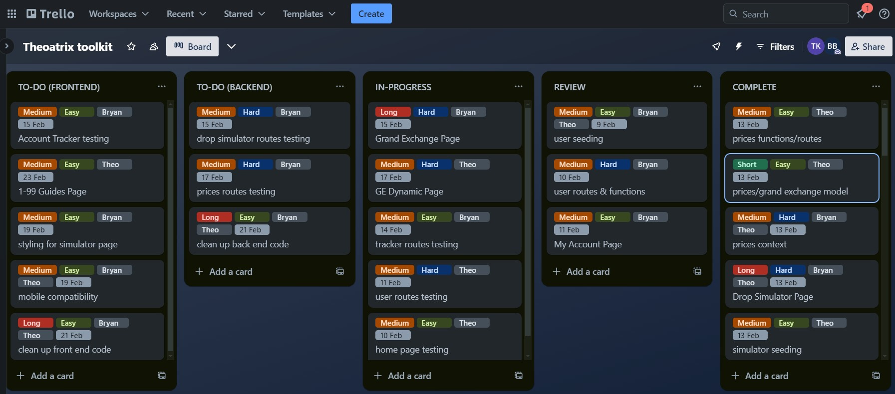

### 29th February
The grand exchange dynamic page and front page were completed. Testing was also completed.
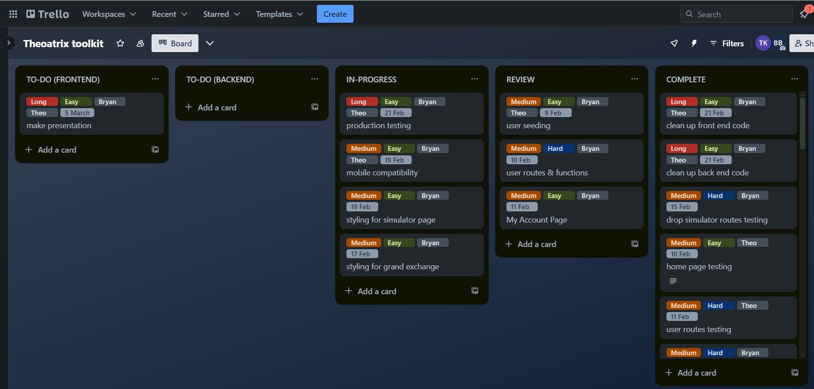