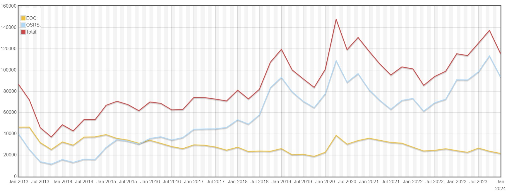
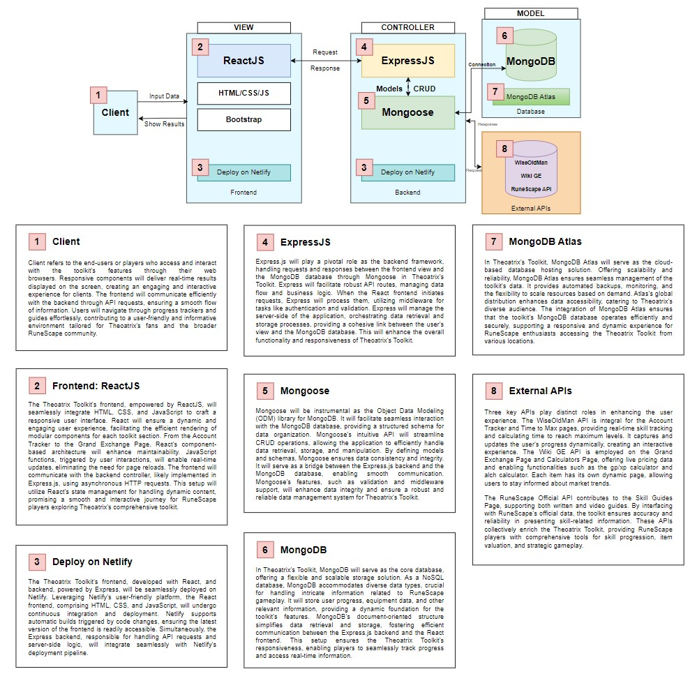
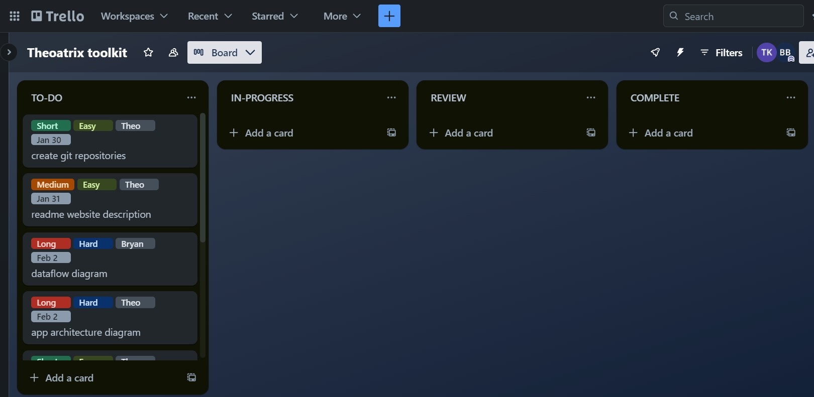
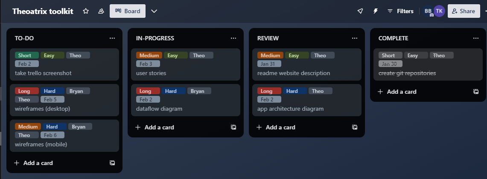

# Theoatrix Toolkit

Frontend Repository: https://github.com/theomarentes/theoatrix-toolkit-frontend

Backend Repository: https://github.com/theomarentes/theoatrix-toolkit-backend 

---

### Table Of Contents
[Website Description](https://github.com/theomarentes/toolkit.theoatrix.net#website-description)

[Application Architecture Diagram](https://github.com/theomarentes/toolkit.theoatrix.net#application-architecture-diagram)

[Dataflow Diagram](https://github.com/theomarentes/toolkit.theoatrix.net#dataflow-diagram)

[User Stories](https://github.com/theomarentes/toolkit.theoatrix.net#user-stories)

[Wireframes](https://github.com/theomarentes/toolkit.theoatrix.net#wireframes)

[Libraries Used](https://github.com/theomarentes/toolkit.theoatrix.net#libraries-used)

[Testing](https://github.com/theomarentes/toolkit.theoatrix.net#testing)

[Trello Board](https://github.com/theomarentes/toolkit.theoatrix.net#trello-board)

---

## Website Description
The Theoatrix Toolkit will allow users to solve complex calculations with the goal of improving their experience playing RuneScape.

### Purpose
In RuneScape, players control a single character, enduring long grinds to increase their skill levels and aquire top tier equipment. The Theoatrix Toolkit will make difficult skill level calculations easier, it will track the user’s progress in the game and track the prices of equipment, using 3 different APIs.

WiseOldMan API: https://docs.wiseoldman.net/

Wiki GE API: https://prices.runescape.wiki/api/v1/osrs

Official API: https://secure.runescape.com/m=hiscore_oldschool/

Our database will store information from these APIs with periodic and user triggered scrapes.

### App Structure
Account Tracker Page
- WiseOldMan API

Level 1-99 Guides Page
- Links to video guides
  
Calculators Page
- Time to Max (WiseOldMan API)
- Alch calculator (dynamic pages for each item) (Wiki GE API)

Simulators Page
- Drop Simulator (OSRSBox JSON)

Grand Exchange Page
- Wiki GE API
- Hourly scrapes to database
- One page per item (dynamic)
  
My Account Page
- User login
- Favourite calculators
- Favourite items
- Favourite guides

### Target Audience
The Theoatrix Toolkit targets RuneScape players & Theoatrix's fans. The toolkit is for RuneScape enthusiasts seeking an all-in-one solution to enhance their gameplay and stay informed about the dynamic world of RuneScape.

Above: RuneScape's Concurrent Player Count (2013-2024)

From seasoned players looking for advanced strategies to newcomers eager to navigate the intricacies of the game, Theoatrix's toolkit aspires to be a gaming companion, empowering players at every level.

### Tech Stack
The upcoming Theoatrix RuneScape Toolkit will be developed using the MERN (MongoDB, Express.js, React, Node.js) stack.
MongoDB, a NoSQL database, will efficiently store diverse user and equipment data.
Express.js will facilitate backend development, integrating with Node.js for server-side execution.
The frontend will leverage React, ensuring a responsive user interface.
The MERN stack will enable real-time updates on in-game progress and item prices. As users explore Theoatrix's guide videos and written content, the MERN stack will give a dynamic experience. 

## Application Architecture Diagram

## Dataflow Diagram	
HD: Provides dataflow diagram(s) that strictly follow the standard convensions to clearly identify the processes within your application. Clearly depicts where data is coming from, where it is going and how it is being stored.

## User Stories
**Story:** As a low level RuneScape player, I want to see how long it will take me to get to level 99 in magic, so that I can estimate how many months before I can defeat this boss.

**Tookit Feature:** Account Tracker Page

**Description:** The toolkit will allow a player to input their RuneScape name and it will show how long it takes to reach level 99 in any skill.

**Edits:** 

---

**Story:** As a player with level 94 crafting, I want to read a crafting levelling guide, so that I can get to level 99 crafting as fast as possible.

**Tookit Feature:** Skill Guides Page

**Feature:** The toolkit will include written guides for every skill in RuneScape, showing how to level up from 1 to 99 (already written).

**Edits:** 

---

**Story:** As a player with level 68 smithing, I want to know what levelling method I should be using, so that I can earn coins while I level up.

**Tookit Feature:** Skill Guides Page

**Feature:** The toolkit will include video guides for every skill in RuneScape, showing how to level up from 1 to 99 (already written).

**Edits:** 

---

**Story:** As a player with 100 million gold coins, I want to know how much construction experience I can gain by spending it all, so that I can upgrade my player-owned-house.

**Tookit Feature:** Calculators Page -> GP/XP Calculator

**Feature:** The toolkit's gp/xp calculators will allow users to view the cost of levelling. Gp/xp stands for gold pieces per experience point.

**Edits:** Removed GP/XP Calculator due to large amount of data required to function.

---

**Story:** As a player with 4300 hours played, I want to know how many hours are left until I reach level 99 in every skill, so that I can plan ahead with what skills to train.

**Tookit Feature:** Calculators Page -> Time To Max

**Feature:** The toolkit's time to max calculator will allow players to input their RuneScape name and see exactly how many hours remain before they reach level 99 in every skill if they play efficiently. This will be done using the WiseOldMan API.

**Edits:** 

---

**Story:** As a player with high combat levels, I want to see what drops I'll get from a boss, so that I can see how much money I'm going to make.

**Tookit Feature:** Simulators Page

**Feature:** The toolkit's simulators will display drops from all bosses and monsters so that the user can simulate the potential loot.

**Edits:**  User Story added 2/2/24 - Added simulators functionality to plan.

---

**Story:** As a player with 4 million bird's nests, I want to track the price of bird's nests, so that I can sell them when they increase by 10%.

**Tookit Feature:** Grand Exchange Page

**Feature:** The toolkit's grand exchange feature will allow users to search for any RuneScape item to see the price graph and trade volume. This will be done with the Wiki GE API.

**Edits:**  Adding alerts for a 10% price increase can be a future feature.

---

**Story:** As a Theoatrix Fan, I want to save my favourite guides and calculators, so that I can use them in the future.

**Tookit Feature:** My Account Page

**Feature:** The toolkit will allow users to login and save calculators and guides to their account.

**Edits:** 

## Wireframes
for multiple standard screen sizes, created using industry standard software
Utilise an industry standard program for creation of wireframes
Provide UX/UI design documentation(wireframes) that adequately show Agile methodology implementation.
HD: Provides wireframes that show exceptional planning of project flow and structure including but not limited to space distribution, content prioritisation, intended actions, functions, relationships between screens.

## Libraries Used
Will be completed with Part B

## Testing
Development Testing
Production Testing
Will be completed with Part B

## Trello Board
Our chosen planning methodology involved using Trello to track tasks.

### 30th January (Initial Board)
Our initial board consisted of the tasks required to complete Part A.

### 31st January 
Progress continued with Trello keeping us on track and ensuring smooth progress through the required tasks.

